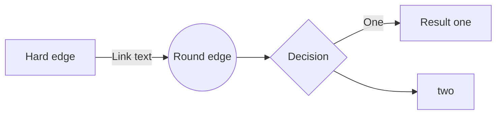
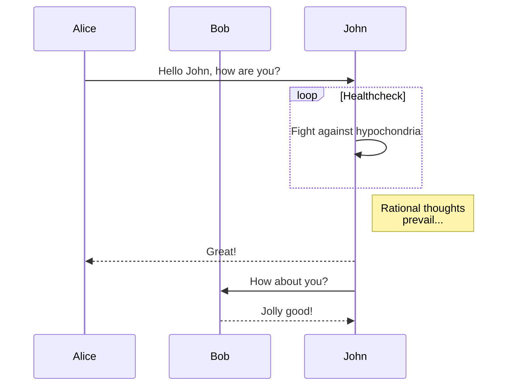
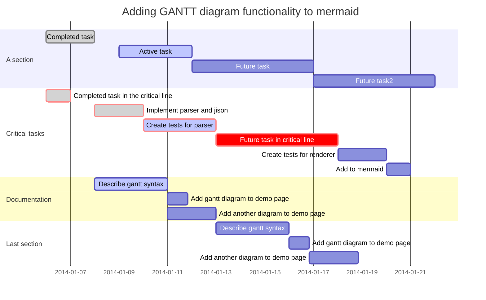
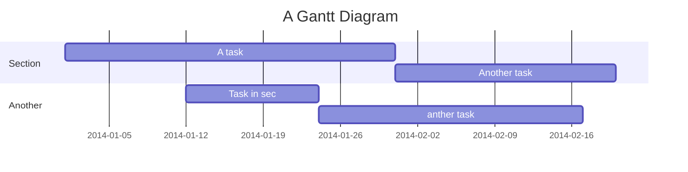

# Example
## [See Orginal Markdown File](md/example.md)

-----
# Tutorial

Use the links below to learn several syntax, the most basic syntax you have to learn is `markdown`, please reach the first two link for detail.
- Markdown Syntax
    + [Markdown Basic][basic]
    + [GitHub Flavored Markdown][gfm]
- MathJax for typing equation
    + [MathJax and TeX Syntax][mathjax]
    + [TeX Syntax for Chemistry][chem]
- TimelineJS for beautifully crafted timlines
    - [TimelineJS][timelinejs]
- Mermaid for drawing graph by text
    + [Mermaid Flowchart][flowchart]
    + [Mermaid Sequence][sequence]
    + [Mermaid Gantt][gantt]

-----
# Headings 1
## Headings 2

    heading 1 - 2 will be aligned center,
    heading 3 - 6 will be aligned to left


### Headings 3
#### Headings 4
##### Headings 5
###### Headings 6

-----
# Styling text

- *Italic*
- **Bold**
- ***Bold and Italic***
- ~~Delete~~

### markdown syntax
``` md
- *Italic*
- **Bold**
- ***Bold and Italic***
- ~~Delete~~
```

-----
# Blockquotes
> Empty your mind, be *formless*. *Shapeless*, like **water**. If you put water into a cup, it becomes the cup. You put water into a bottle and it becomes the bottle. You put it in a teapot, it becomes the teapot. Now, water can *flow* or it can *crash*. ***Be water, my friend***.”

### markdown syntax
``` md
> Empty your mind, be *formless*. *Shapeless*, like **water**. If you put water into a cup, it becomes the cup. You put water into a bottle and it becomes the bottle. You put it in a teapot, it becomes the teapot. Now, water can *flow* or it can *crash*. ***Be water, my friend***.”
```

-----
# Syntax Highlight

There are **multiple syntax highlighting themes** to choose from. Here's one of them:

``` javascript
// All the code you will ever need
var hw = "Hello World!"
alert(hw);
```

-----
# List

- You just **type naturally**, and the result looks good.
- You **don't have to worry** about clicking formatting buttons.
  - Or fiddling with indentation. (Two spaces is all you need.)

To see what else you can do with [Markdown][basic]
(including **tables**, **images**, **numbered lists**, and more)

-----
# Image
you can also make link to your image
``` md
[](link/to/page.html)

```

![image][image1]


-----
# Table

|Name      | Lunch order        | Owes       |
|:-------  | :----------------: | ---------: |
|Joan      | saag paneer        | $11        |
|Sally     | vindaloo           | $14        |
|Erin      | lamb madras        | $5         |

-----
# [Octicons][octicons]

There are many icons you can use, here are some example.
For Details, please go to [octicons page][octicons]

| Icon                                            | Code                                              |
| :---:                                           | :---:                                             |
| <span class="octicon octicon-heart"></span>     | `<span class="octicon octicon-heart"></span>`     |
| <span class="octicon octicon-hourglass"></span> | `<span class="octicon octicon-hourglass"></span>` |
| <span class="octicon octicon-lock"></span>      | `<span class="octicon octicon-lock"></span>`      |
| <span class="octicon octicon-gear"></span>      | `<span class="octicon octicon-gear"></span>`      |
| <span class="octicon octicon-person"></span>    | `<span class="octicon octicon-person"></span>`    |
| <span class="octicon octicon-tag"></span>       | `<span class="octicon octicon-tag"></span>`       |
| <span class="octicon octicon-squirrel"></span>  | `<span class="octicon octicon-squirrel"></span>`  |

-----
# Column 1

1. apple
2. orange
3. pear


# Column 2
- foo
- bar

-----
# GFM markdown line break

Lorem *ipsum* dolor sit amet, consectetur adipisicing elit, sed do eiusmod tempor incididunt ut labore et dolore magna aliqua.
Ut enim ad minim **veniam**, quis nostrud exercitation ullamco laboris nisi ut aliquip ex ea commodo consequat.

Duis aute irure dolor in ***reprehenderit*** in voluptate velit esse cillum dolore eu fugiat nulla pariatur.
Excepteur sint ~~occaecat~~ cupidatat nonproident, sunt in culpa qui officia deserunt mollit anim id est laborum.

-----
# YouTube


<div class="screen-only"><iframe width="560" height="315" src="https://www.youtube.com/embed/4O9o4CKTGzQ" frameborder="0" allowfullscreen></iframe></div>

<div class="print-only">www.youtube.com/embed/4O9o4CKTGzQ</div>

-----
# [TimelineJS][timelinejs]

<div class="screen-only"><iframe src='http://cdn.knightlab.com/libs/timeline/latest/embed/index.html?source=0Agl_Dv6iEbDadHdKcHlHcTB5bzhvbF9iTWwyMmJHdkE&font=Bevan-PotanoSans&maptype=toner&lang=en&height=650' width='960' height='650' frameborder='0'></iframe></div>

-----

# GoogleMap

<iframe src="https://www.google.com/maps/embed?pb=!1m14!1m8!1m3!1d1844.1148177117416!2d114.20711185515593!3d22.420381136700325!3m2!1i1024!2i768!4f13.1!3m3!1m2!1s0x3404089ce8ada749%3A0x5bd1c53294d0f7ce!2sThe+Chinese+University+of+Hong+Kong!5e0!3m2!1sen!2s!4v1429842328715" width="600" height="450" frameborder="0" style="border:0"></iframe>


-----
# [MathJax][mathjax]

Equaton are type inside `$ ... $` for inline, or `$$ ... $$` for paragraph.

### e.g.

>My math is so rusty that I barely remember the _quadratic equation_:

>When $$$a \ne 0$$$, there are two solutions to $ax^2 + bx + c = 0$ and they are
$$x = {-b \pm \sqrt{b^2-4ac} \over 2a}$$

```tex
% example of math equation
ax^2 + bx + c = 0
x = {-b \pm \sqrt{b^2-4ac} \over 2a}
```

-----
# [Chemistry Equation][chem]

Chemistry Equation can work like math equation, inline sytle like $\ce{C6H5}$, or paragraph style like below:
$$
\ce{C6H5-CHO}
\ce{$A$ ->[\ce{+H2O}] $B$}
\ce{SO4^2- + Ba^2+ -> BaSO4 v}
$$


``` tex
% example code of chemistry equation
\ce{C6H5-CHO}
\ce{$A$ ->[\ce{+H2O}] $B$}
\ce{SO4^2- + Ba^2+ -> BaSO4 v}
```

-----
# Mermaid
## Flowchart, Sequence Diagram, Gantt

Include all graph syntax with code language `mermaid`:

<pre class="hljs md">

</pre>

-----
# Flowchart


[Learn][flowchart] and [try][editor] Mermaid.JS for flowchart.

-----
# Squence



[Learn][sequence] and [try][editor] Mermaid.JS for sequence diagram.

-----
# Gantt






[Learn][gantt] and [try][editor] Mermaid.JS for gantt graph.

----
# Furthermore
- Print this presenation
- View it on mobile
- Print Only
    + `<div class='print-only'> your code </div>`
- Screen Only
    + `<div class='screen-only'> your code </div>`


----
# End

[basic]: https://help.github.com/articles/markdown-basics/
[gfm]: https://help.github.com/articles/github-flavored-markdown/
[timelinejs]: http://timeline.knightlab.com/
[mathjax]: http://meta.math.stackexchange.com/questions/5020/mathjax-basic-tutorial-and-quick-reference
[chem]: ftp://ftp.comp.hkbu.edu.hk/pub/TeX/CTAN/macros/latex/contrib/mhchem/mhchem.pdf
[octicons]: https://octicons.github.com/
[flowchart]: http://knsv.github.io/mermaid/flowchart.html
[sequence]: http://knsv.github.io/mermaid/sequenceDiagram.html
[gantt]: http://knsv.github.io/mermaid/gantt.html
[editor]: http://knsv.github.io/mermaid/live_editor/
[image1]:http://2.bp.blogspot.com/-dxJbW0CG8Zs/TmkoMA5-cPI/AAAAAAAAAqw/fQpsz9GpFdo/s1600/voyage-dans-la-lune-1902-02-g.jpg
